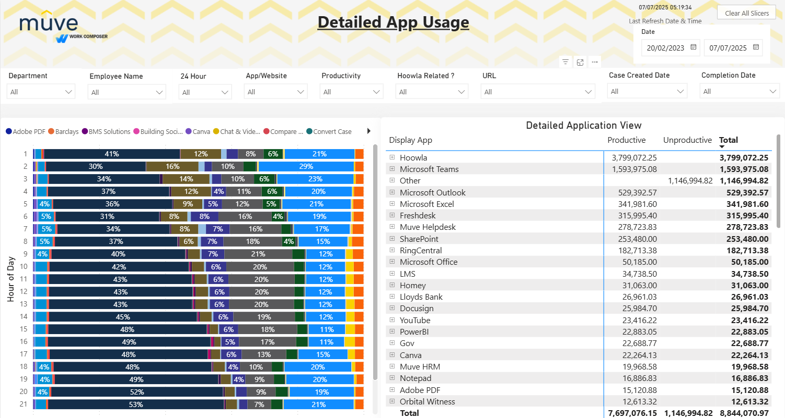

# Time Tracking Dashboard

## 📌 Overview
This Power BI dashboard allows team leads and managers to monitor how employees spend their time during working hours. It helps identify productive patterns and potential inefficiencies.

## 🎯 Key Features
- Daily, weekly, and monthly time summaries
- Active vs idle time tracking
- Department-wise breakdown
- Trend analysis and filtering options

## 🛠️ Tools Used
- Power BI
- DAX
- SQL
- Excel

## 🔍 Insights & Takeaways
Through this dashboard, I practiced:
- Building clean UX layouts in Power BI
- Writing advanced DAX for date and time manipulation
- Designing performance-optimized visuals

## 📸 Dashboard Preview

